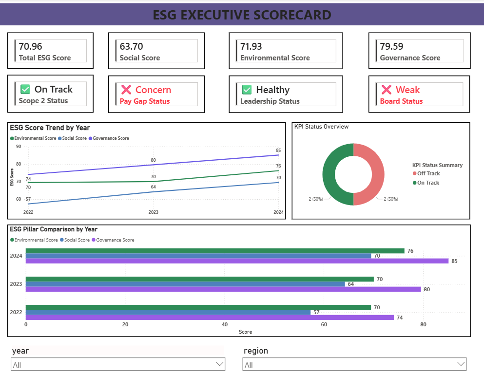
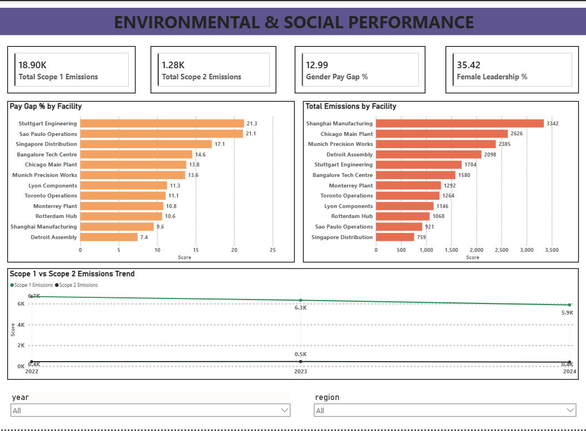
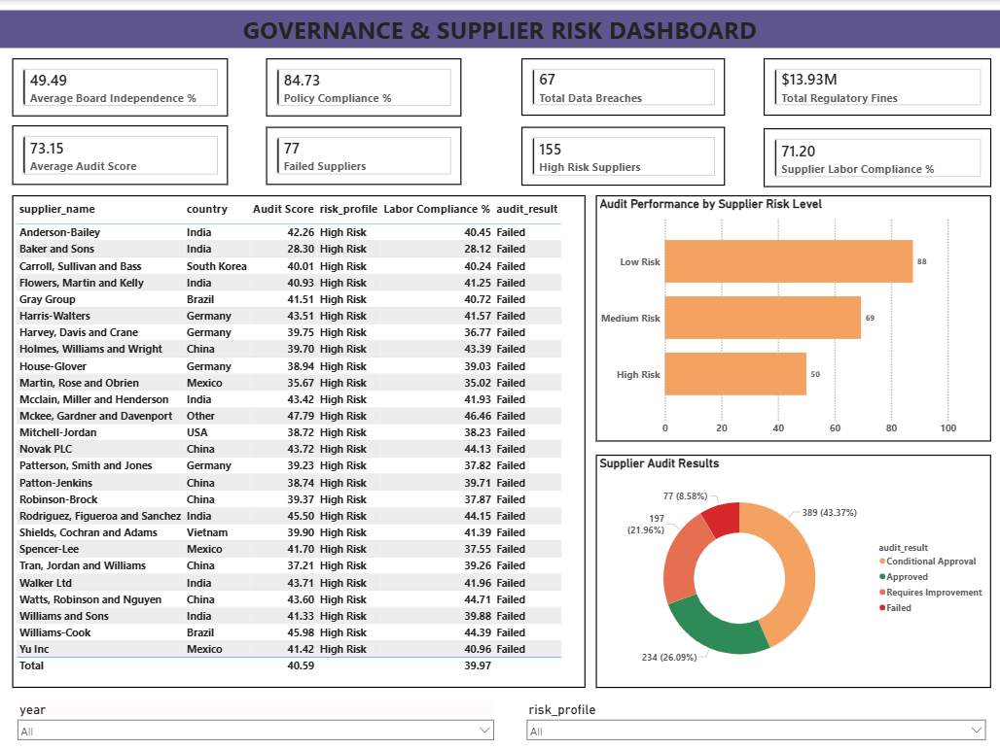

# ESG Analytics Dashboard — Meridian Manufacturing Group

> An advanced data analytics project tracking 15 ESG KPIs across 
> Environmental, Social, and Governance pillars for a 12-facility 
> manufacturing company using Python, MySQL, and Power BI.

---

## Business Problem

Meridian Manufacturing Group is preparing for mandatory ESG reporting 
under the EU CSRD framework. The sustainability team has raw operational 
data across 4 disconnected sources — energy consumption, workforce 
records, supplier audits, and governance compliance logs. No structured 
analysis exists. Investors and regulators are asking for ESG performance 
reports before the next board meeting.

Three questions needed answering:
- Which ESG KPIs are on track vs off track against 2025 targets?
- Where are the biggest risks across Environmental, Social, and 
  Governance pillars?
- What is the financial exposure from underperforming KPIs?

---

## Key Findings

- **Overall ESG Score improved from 67 to 71** across 2022-2024 
  but Social pillar remains the weakest at 63.70
- **Gender Pay Gap at 12.99%** — significantly above the 5% target, 
  indicating compensation equity issues across facilities
- **Female Leadership at 35.42%** — below the 40% target with zero 
  improvement across 3 years
- **Governance score highest at 79.59** — board independence and 
  policy compliance showing consistent improvement
- **Shanghai Manufacturing** is the highest emitting facility — 
  3,342 tCO2e total emissions
- **26% of supplier audits Failed** — High Risk suppliers averaging 
  only 50/100 audit score

---

## Dashboard Preview

### Page 1 — ESG Executive Scorecard


### Page 2 — Environmental & Social Performance


### Page 3 — Governance & Supplier Risk


---

## Dataset

No public ESG dataset exists for manufacturing companies at this 
granularity. This project uses 4 synthetically generated datasets 
built from scratch in Python, modeled on real CSRD reporting 
structures and industry benchmarks.

| Dataset | Rows | What It Contains |
|---|---|---|
| Energy & Emissions | 23,447 | Meter-level readings per facility per month |
| Workforce & Social | 26,928 | Individual employee records per year |
| Supplier Compliance | 897 | Supplier audit records across 150 vendors |
| Governance | 4,320 | Policy compliance per facility per month |
| KPI Summary | 3 | Annual ESG scores — one per year |
| **Total** | **55,595** | |

### Facilities Covered
12 manufacturing facilities across North America, Europe, 
Asia Pacific, and Latin America.

### ESG Targets (2025)
| KPI | Target |
|---|---|
| Scope 1 Emissions Reduction | 20% from 2022 baseline |
| Scope 2 Emissions Reduction | 30% from 2022 baseline |
| Gender Pay Gap | Below 5% |
| Female Leadership | Above 40% |
| Injury Rate | Below 2.0 per 100 employees |
| Training Hours | Above 40 hours per employee |
| Supplier Labor Compliance | Above 90% |
| Board Independence | Above 60% |
| Policy Compliance | Above 95% |
| Data Breach Incidents | Zero |

---

## Methodology

### 1. Data Generation
4 synthetic datasets generated using Python with realistic patterns:
- 12 facilities across 4 regions
- 3 years of data (2022-2024) with improving trends built in
- Realistic gender pay gap and leadership diversity gaps
- Supplier risk profiles — Low, Medium, High Risk
- Intentional data quality issues for cleaning practice

### 2. Data Cleaning
Each dataset cleaned independently:

| Dataset | Issues Fixed |
|---|---|
| Energy | Null consumption (grouped median), duplicates, region casing, negative values |
| Workforce | Null training hours (grouped median by job level), duplicates, salary validation |
| Supplier | Null audit scores (grouped median by risk profile), score clipping to 0-100, duplicates |
| Governance | Null fines filled with 0 (no fine = 0 not missing), duplicates, range validation |

### 3. SQL Analysis
27 queries across all 4 datasets covering:
- Emissions trend and facility ranking
- Gender pay gap and leadership diversity
- Supplier audit performance and risk flagging
- Governance compliance and board independence
- ESG KPI vs target tracking

### 4. Power BI Dashboard
3-page interactive dashboard with conditional formatting,
KPI status indicators, and cross-table relationships.

---

## SQL Analysis Highlights

| Query | Technique |
|---|---|
| YoY Emissions Change | LAG() window function |
| Top 3 Emitting Facilities | CTE + RANK() |
| Gender Pay Gap by Facility | CASE WHEN AVG |
| Supplier Improvement Trend | CTE + LAG() |
| KPIs On Track vs Off Track | Nested CASE WHEN |
| ESG Score Trend | LAG() window function |

See `sql/esg_queries.sql` for all 27 queries with comments.

---

## Project Structure

```
esg-analytics-dashboard/
│
├── data/
│   ├── esg_energy_emissions_raw.csv
│   ├── esg_energy_emissions_clean.csv
│   ├── esg_workforce_social_raw.csv
│   ├── esg_workforce_social_clean.csv
│   ├── esg_supplier_compliance_raw.csv
│   ├── esg_supplier_compliance_clean.csv
│   ├── esg_governance_raw.csv
│   ├── esg_governance_clean.csv
│   └── esg_kpi_summary.csv
│
├── notebooks/
│   └── 01_esg_data_cleaning.ipynb
│
├── sql/
│   └── esg_queries.sql
│
├── dashboard/
│   └── esg_dashboard.pbix
│
├── reports/
│   └── esg_investor_memo.pdf
│
├── screenshots/
│   ├── page1.png
│   ├── page2.png
│   └── page3.png
│
├── generate_esg_dataset.py
└── README.md
```

---

## Tools Used

| Tool | Purpose |
|---|---|
| Python 3.x | Dataset generation and data cleaning |
| Pandas | Data manipulation and transformation |
| NumPy | Synthetic data generation |
| Faker | Realistic name and company generation |
| Matplotlib / Seaborn | Exploratory visualizations |
| MySQL Workbench | SQL analytical queries — 27 queries |
| Power BI Desktop | Interactive 3-page ESG dashboard |

---

## How To Run

### Prerequisites
```bash
pip install pandas numpy faker matplotlib seaborn sqlalchemy pymysql
```

### Step 1 — Generate Datasets
```bash
python generate_esg_dataset.py
```
Creates 5 CSV files in `data/` folder.

### Step 2 — Run Cleaning Notebook
```bash
jupyter notebook
```
Open `notebooks/01_esg_data_cleaning.ipynb`
Run all cells sequentially.

### Step 3 — Load Into MySQL
Create database in MySQL Workbench:
```sql
CREATE DATABASE esg_analysis;
```
Import each cleaned CSV using Table Data Import Wizard.

### Step 4 — Run SQL Queries
Open `sql/esg_queries.sql` in MySQL Workbench.
Run queries individually — do not run all at once.

### Step 5 — Open Dashboard
Open `dashboard/esg_dashboard.pbix` in Power BI Desktop.
Reconnect to MySQL or CSV files if prompted.

---

## Resume Bullet

> Built an ESG analytics dashboard tracking 15 KPIs across 
> Environmental, Social, and Governance pillars for a 12-facility 
> manufacturing company using Python, MySQL, and Power BI, 
> identifying Gender Pay Gap (12.99%) and stagnant Female Leadership 
> (35.42%) as the two most critical Social underperformers against 
> CSRD 2025 targets, with Governance scoring highest at 79.59 driven 
> by improving board independence trends.

---


## Author

**Shrey Aggrawal**


---

*Generated from synthetic dataset modeled on CSRD reporting 
standards for analytical demonstration purposes.*
